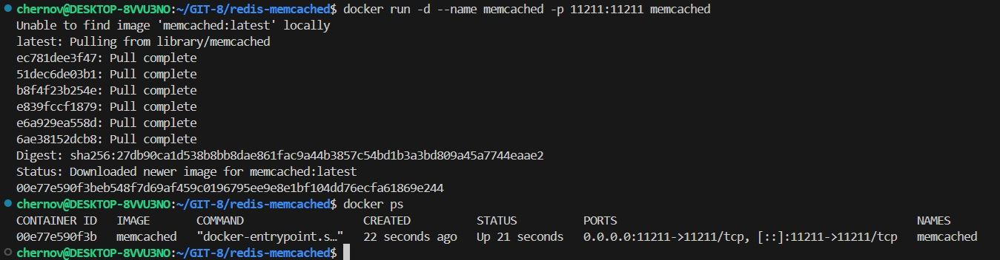
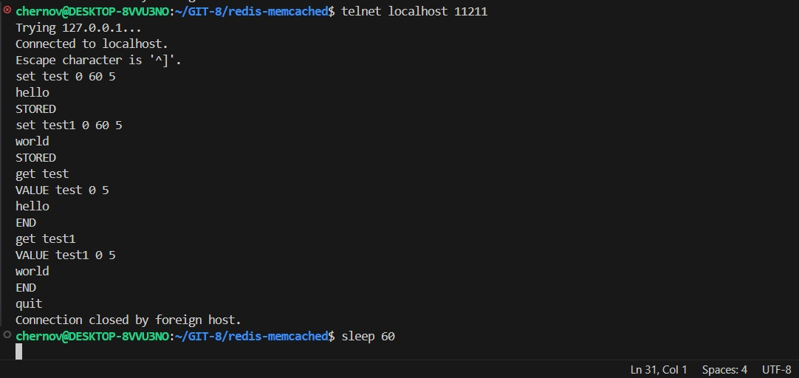
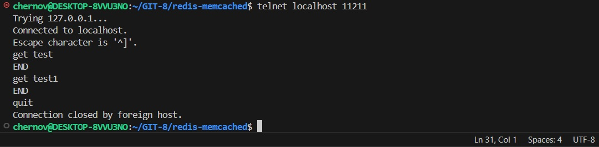
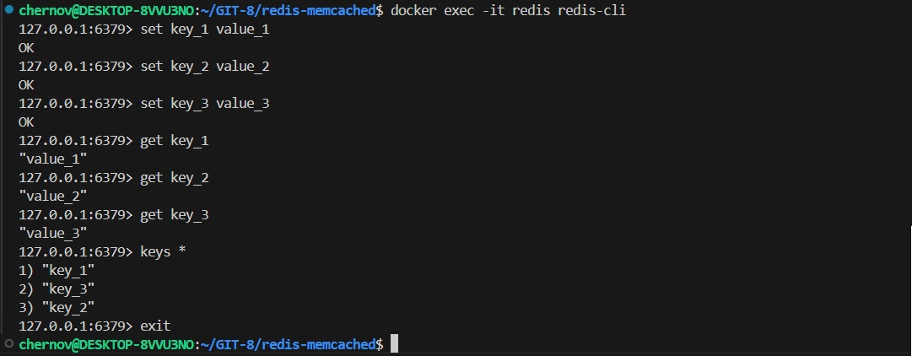
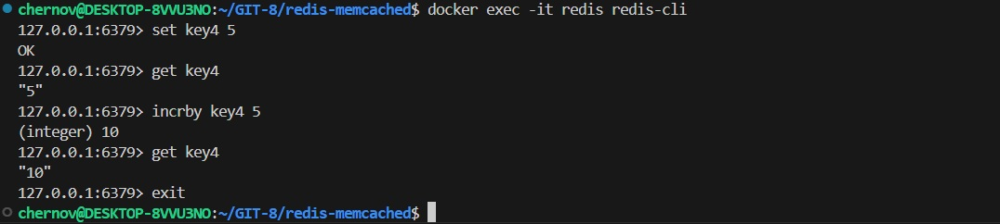

# Домашнее задание к занятию "`Кеширование Redis/memcached`" - `Chernov Vyacheslav`

## Задание 1. Кеширование
Приведите примеры проблем, которые может решить кеширование.

*Приведите ответ в свободной форме.*
***
## *Ответ*
Кеширование повышает производительность системы Кеширование оптимизирует работу системы за счет, расположения в быстром кеше данных, к которым выполняются запросы чаще всего, а так же экономии ресурсов (обращаемся не к БД а к кешу) и сглаживания бустов трафика во время пиковых нагрузок обращений к БД.
***

## Задание 2. Memcached
Установите и запустите memcached.

*Приведите скриншот systemctl status memcached, где будет видно, что memcached запущен.*
***
## *Ответ*

`

***
## Задание 3. Удаление по TTL в Memcached
Запишите в memcached несколько ключей с любыми именами и значениями, для которых выставлен TTL 5.

*Приведите скриншот, на котором видно, что спустя 5 секунд ключи удалились из базы.*
***
## *Ответ*

`

`

***
## Задание 4. Запись данных в Redis
Запишите в Redis несколько ключей с любыми именами и значениями.

*Через redis-cli достаньте все записанные ключи и значения из базы, приведите скриншот этой операции.*
***
## *Ответ*

`

***

## Задание 5*. Работа с числами
Запишите в Redis ключ key5 со значением типа "int" равным числу 5. Увеличьте его на 5, чтобы в итоге в значении лежало число 10.

*Приведите скриншот, где будут проделаны все операции и будет видно, что значение key5 стало равно 10.*
***
## *Ответ*

`

***